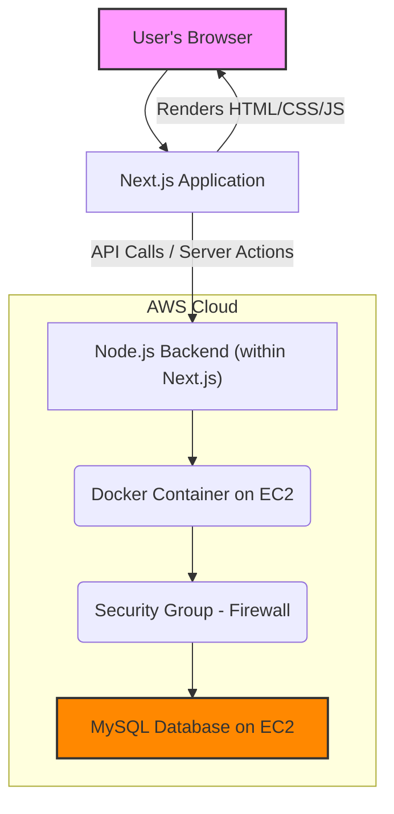
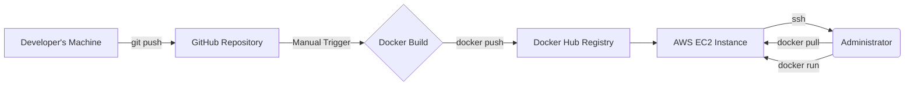

# Blueprint: Advanced Full-Stack E-Commerce Platform

[](https://nextjs.org/)
[](https://react.dev/)
[](https://www.docker.com/)
[](https://aws.amazon.com/ec2/)
[](https://www.typescriptlang.org/)
[](https://orm.drizzle.team/)

**This project serves as a comprehensive blueprint for building modern, full-stack web applications.** It is designed to be scalable, maintainable, and type-safe, utilizing a cutting-edge technology stack, cloud infrastructure on AWS, and a complete DevOps workflow with Docker.

---

## 🧭 Table of Contents

* [🌟 Project Philosophy](#-project-philosophy)
* [🚀 Live Demo](#-live-demo)
* [✨ Key Features](#-key-features)
* [🏗️ Architectural Deep Dive](#️-architectural-deep-dive)
    * [System Architecture Diagram](#system-architecture-diagram)
    * [Technology Layers](#technology-layers)
* [🛠️ Technology Stack & Rationale](#️-technology-stack--rationale)
* [☁️ Infrastructure & Deployment](#️-infrastructure--deployment)
    * [Deployment Workflow](#deployment-workflow)
    * [Containerization Strategy](#containerization-strategy)
* [🚀 Getting Started](#-getting-started)
* [📂 Project Structure](#-project-structure)
* [🤝 Contributing](#-contributing)
* [📄 License](#-license)

---

## 🌟 Project Philosophy

This project was built on three core principles:

1.  **End-to-End Type Safety:** To minimize runtime errors and improve developer confidence. This is achieved by leveraging **TypeScript** across the stack, coupled with **Zod** for schema validation and **Drizzle ORM** for type-safe database interactions.
2.  **Server-First Approach:** To optimize performance and reduce client-side load. We utilize the **Next.js App Router**, **React Server Components (RSC)**, and **Server Actions** to perform as much work as possible on the server.
3.  **Pragmatic & Maintainable Codebase:** To ensure long-term viability. We use established best practices, a clear project structure, and tools like **ESLint** and **Prettier** to maintain high code quality.

---

## 🚀 Live Demo

**[➡️ View the live application here (if available)](https://youtu.be/-oNUkM48aGQ?si=KbYZtfUOdIXHiZKS)**

---

## ✨ Key Features

* **⚡ High Performance:** Optimized with Next.js 15, RSC, and Turbopack.
* **🔒 Secure Backend:** Features Type-Safe APIs, Server Actions, and a robust authentication system.
* **📱 Modern & Responsive UI:** Built with Tailwind CSS 4 and accessible Radix UI components.
* **☁️ Cloud-Native Deployment:** Containerized with Docker and deployed on AWS EC2.
* **💳 Payment Integration:** Supports payment via PromptPay QR Code.
* **🗂️ Advanced Data Handling:** Powerful data tables, server-side caching, and complex form management.
* **🎨 Interactive UX:** Includes features like Drag & Drop, data visualization charts, and toast notifications.

---

## 🏗️ Architectural Deep Dive

### System Architecture Diagram

This diagram illustrates the high-level flow of the system from the user to the database.



### Technology Layers

| Layer                   | Technology / Service                                     |
| :---------------------- | :------------------------------------------------------- |
| **Presentation** | React 19, Tailwind CSS 4, Radix UI, Recharts             |
| **Application Logic** | Next.js 15 App Router, Server Actions, TypeScript        |
| **State Management** | TanStack Query (Server State) + Zustand (Client State)   |
| **Data Access** | Drizzle ORM                                              |
| **Database** | Self-Hosted MySQL on AWS EC2                             |
| **Deployment** | Docker, Docker Hub                                       |
| **Infrastructure** | AWS EC2                                                  |

---

## 🛠️ Technology Stack & Rationale

<details>
<summary><strong>📦 Core Framework & Language</strong></summary>

* **Next.js 15:** Chosen for its complete full-stack capabilities, allowing for both frontend and backend development in a single, modern framework with the App Router.
* **React 19:** Utilized for its new features like the `use` hook and Concurrent Rendering, which improve both user and developer experience.
* **TypeScript 5:** Enforces type safety across the entire application, drastically reducing bugs and improving code maintainability.

</details>

<details>
<summary><strong>🎨 Frontend & UI/UX</strong></summary>

* **Tailwind CSS 4:** A utility-first CSS framework that enables rapid and consistent development of complex UIs.
* **shadcn/ui & Radix UI:** Used for their unstyled, accessible, and highly composable UI primitives, giving us full control over component styling and behavior.
* **TanStack Query:** The cornerstone of our data fetching strategy. It manages server state, caching, prefetching, and mutations to create a snappy and optimistic UI.
* **Zustand:** A lightweight state manager for handling simple, global client-side state without the boilerplate of more complex solutions.
* **React Hook Form & Zod:** A powerful combination for managing complex forms and ensuring robust, type-safe validation.

</details>

<details>
<summary><strong>🔧 Backend & Data Layer</strong></summary>

* **Drizzle ORM:** A TypeScript-native ORM chosen for its performance, type-safety, and intuitive SQL-like syntax. `drizzle-kit` is used for seamless schema migrations.
* **MySQL (on EC2):** A battle-tested relational database. Self-hosting on EC2 provides full control over the database environment and configuration.
* **`better-auth`:** A customizable authentication system implemented to fit the specific needs of the project.
* **`busboy`:** A streaming parser used on the backend to efficiently handle large file uploads without high memory consumption.

</details>

---

## ☁️ Infrastructure & Deployment

### Deployment Workflow

This project follows a container-based deployment workflow to ensure consistency from local development to production.



### Containerization Strategy

The application is containerized using Docker to create a portable and isolated environment. The `Dockerfile` is optimized for Next.js:

1.  **Dependency Caching:** Utilizes multi-stage builds to separate dependency installation from code building, allowing Docker to cache the `node_modules` layer.
2.  **Lean Production Image:** The final image is built on a minimal base (e.g., `node:18-alpine`) and includes only the necessary production artifacts, resulting in a smaller, more secure image.
3.  **Graceful Shutdowns:** Implements proper signal handling to ensure the Next.js server shuts down gracefully.

---

## 🚀 Getting Started

### Prerequisites

* Node.js (v18.x or newer)
* Docker Desktop
* A running MySQL Database instance (can be local or on EC2)

### Installation

1.  **Clone the repository:**
    ```bash
    git clone [https://github.com/Thanabodee-Pond/advanced-nextjs-app.git](https://github.com/Thanabodee-Pond/advanced-nextjs-app.git)
    cd advanced-nextjs-app
    ```
2.  **Install dependencies:**
    ```bash
    npm install
    ```
3.  **Set up Environment Variables:**
    Create a `.env.local` file from the example template.
    ```bash
    cp .env.example .env.local
    ```
    Now, edit `.env.local` with your database credentials.
4.  **Run Database Migrations:**
    ```bash
    npx drizzle-kit push:mysql
    ```
5.  **Run the Development Server:**
    ```bash
    npm run dev
    ```
    The application will be available at `http://localhost:3000`.

### Running with Docker

1.  **Ensure Docker is running.**
2.  **Create your `.env.local` file** as described above.
3.  **Build and run the container:**
    ```bash
    docker build -t advanced-nextjs-app .
    docker run -p 3000:3000 --env-file ./.env.local advanced-nextjs-app
    ```

---

## 📂 Project Structure

The project structure is organized for clarity and scalability:

```
/
├── .next/            # Build output artifacts
├── app/              # Next.js App Router
│   ├── (api)/        # API routes
│   ├── (main)/       # Main application routes with layouts
│   │   ├── _components/ # Components specific to a route group
│   │   └── page.tsx
│   └── layout.tsx    # Root layout
├── components/       # Reusable, shared React components
│   ├── ui/           # Low-level UI components (from shadcn/ui)
│   └── shared/       # Higher-level shared components
├── drizzle/          # Drizzle ORM schema and migration files
├── lib/              # Core utilities, helpers, and configurations
│   ├── db.ts         # Drizzle client instance
│   └── utils.ts      # General utility functions
├── public/           # Static assets (images, fonts)
├── .env.example      # Environment variable template
├── Dockerfile        # Docker container definition
└── next.config.mjs   # Next.js configuration file
```

---

## 🤝 Contributing

Contributions are welcome! Please feel free to fork the repository, make changes, and submit a pull request. For major changes, please open an issue first to discuss what you would like to change.

---

## 📄 License

This project is distributed under the MIT License. See the `LICENSE` file for more details.
